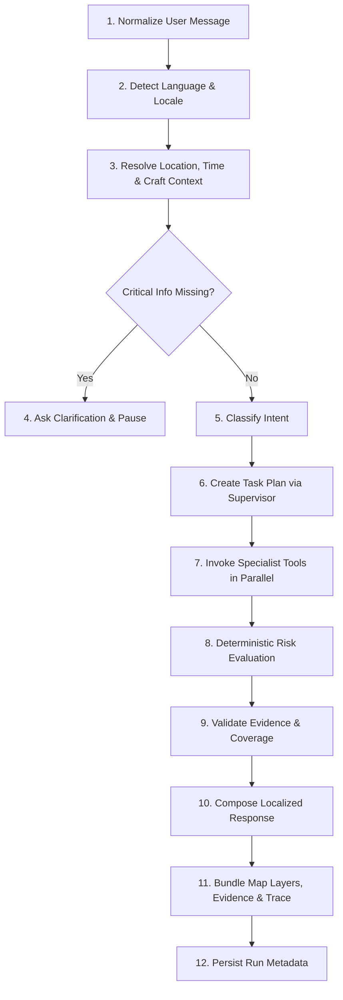

# SAMUDRA Agent Workflow & Orchestration Specification

> **SIH Problem Statement:** PS 26176 — ORCA: Marine EcOsystem Reasoning with Collaborative Agents  
> **Status:** Bounded LangGraph Multi-Agent Architecture Specification

---

## 1. Core Agentic Principles: The Bounded Graph

SAMUDRA implements a **Bounded Collaborative Agent Graph** using **LangGraph**. In high-stakes marine safety and disaster management, uncontrolled agentic autonomy (e.g., open-ended ReAct loops that can hallucinate coordinates or loop indefinitely) is intolerable.

### 1.1 Strict Separation of Cognitive and Deterministic Concerns

| Capability | Assigned To | Mechanism / Technology | Why? |
| :--- | :--- | :--- | :--- |
| **Intent Understanding** | LLM Agent | Prompt + Few-Shot Classification | Resolves ambiguity in informal user queries. |
| **Language & Locale Detection** | LLM Agent | Multilingual system prompt | Handles Hindi, Marathi, Tamil, English, etc. |
| **Clarification Logic** | LLM Agent | Conversational state check | Asks missing departure harbor or craft profile. |
| **Task Planning** | LLM Agent | Structured JSON Planner output | Coordinates needed specialist tools dynamically. |
| **Distance & Geodesics** | Deterministic Tool | Python `pyproj` / Haversine / WGS84 | LLMs cannot calculate great-circle distances reliably. |
| **Geofencing & Polygon Intersect**| Deterministic Tool | `Shapely` / `GeoPandas` | Binary boundary checks must have 100% mathematical certainty. |
| **Safety Thresholds & Risk Status**| Deterministic Tool | Hardcoded Python Risk Rules Engine | Prevents LLM from softening a Cyclone Alert or Wave Warning. |
| **Marine Observations Retrieval** | Deterministic Tool | Connector modules (INCOIS, IMD, etc.) | LLMs must never invent or guess ocean temperature/wave data. |
| **Response Explanation** | LLM Agent | Controlled Response Composer | Synthesizes validated evidence into plain, friendly language. |

---

## 2. The 12-Step Execution Pipeline

Every user interaction traverses a deterministic, state-driven 12-step graph:

### Detailed Pipeline Steps:
1. **Normalize User Message**: Strips noisy formatting, handles basic typos, and cleans text.
2. **Detect Language**: Identifies query language (e.g., `hi`, `mr`, `ta`, `en`) to ensure all subsequent user-facing output returns in the user's native tongue.
3. **Resolve Spatio-Temporal Context**: Extracts geographic origin (e.g., "Ratnagiri", "Veraval", "Chennai"), target coordinates, departure time offsets ("tomorrow morning at 6 AM" -> ISO-8601 UTC timestamp), and vessel class (traditional non-motorized, motorized craft, mechanized trawler).
4. **Clarification Gate**: If essential safety variables (such as departure point or trip window) are entirely absent, the graph branches directly to a clarification response without executing expensive or misleading tool calls.
5. **Classify Intent**: Categorizes query into one of the canonical journeys:
   - `NEAREST_PFZ`
   - `GO_NO_GO_SAFETY`
   - `HAZARD_BOUNDARY`
   - `SAFER_ROUTE`
   - `GENERAL_INFORMATIONAL`
6. **Task Plan Creation**: The Supervisor node generates an execution plan listing which domain tools must run.
7. **Specialist Tool Invocation**: Dispatches calls to marine, weather, or geospatial engines (parallelized where independent).
8. **Deterministic Risk Evaluation**: The hard-coded risk engine evaluates weather conditions, wave thresholds, and geofences to produce an immutable safety state (`GO`, `CAUTION`, `NO_GO`, `UNKNOWN`).
9. **Evidence Validation**: Checks that all numerical claims generated have underlying citations, unexpired validity windows, and source attributions.
10. **Response Composition**: The LLM synthesizes tool outputs and risk states into a clear, natural-language explanation in the user's language.
11. **Bundle Artifacts**: Gathers vector map layers (GeoJSON), evidence provenance cards, and high-level agent execution trace.
12. **Persist Run**: Stores high-level query, execution time, and tool invocation log (session telemetry) without saving internal chain-of-thought.

---

## 3. Specialist Nodes & Node Specifications

### 3.1 Intent & Locale Node
- **Inputs**: Raw message string, conversation history.
- **Outputs**: `language` (ISO 639-1), `detected_intent`, `entities` (location, departure_time, craft_type, voyage_duration).
- **Prompt Guardrail**: No business decision-making. Strict schema output.

### 3.2 Supervisor / Planner Node
- **Role**: Coordinates specialist execution.
- **Rules**:
  - For `NEAREST_PFZ`: Schedules `get_pfz_advisories`, `get_weather_forecast`, and `compute_geodesic_distance`.
  - For `GO_NO_GO_SAFETY`: Schedules `get_marine_weather`, `check_cyclone_warnings`, and `evaluate_safety_thresholds`.
  - For `HAZARD_BOUNDARY`: Schedules `check_marine_hazards`, `query_boundary_geofences`.
  - For `SAFER_ROUTE`: Schedules `generate_candidate_routes`, `evaluate_route_exposure`.

### 3.3 Marine / PFZ Specialist Tool
- **Role**: Queries INCOIS Potential Fishing Zone datasets or local spatial fixtures.
- **Deterministic Functionality**: Calculates bearing and nautical distance from the departure harbor to active PFZ zones. Filters by ocean depth, validity date, and chlorophyll concentration.

### 3.4 Weather & Hazard Specialist Tool
- **Role**: Retrieves ocean state forecast (significant wave height, wave period, swell, wind speed, wind gust) and IMD bulletins (cyclone alerts, squalls, lightning).
- **Deterministic Functionality**: Normalizes units (knots to km/h, feet to meters) and extracts valid-from / valid-to windows.

### 3.5 Geospatial & Route Specialist Tool
- **Role**: Spatial intersection using Shapely.
- **Deterministic Functionality**:
  - Tests whether a point or trajectory intersects with Marine Protected Areas (MPAs), defense firing ranges, or international maritime boundary lines (IMBL).
  - Computes route waypoint safety profiles.

### 3.6 Risk Evaluator Node (Deterministic Rule Engine)
- **Role**: Computes the final decision: `GO` | `CAUTION` | `NO_GO` | `UNKNOWN`.
- **Hard-Stop Rules (Non-negotiable)**:
  - Any active IMD Cyclone Warning or Red Alert = **NO_GO**.
  - Significant wave height exceeding vessel safety threshold (e.g. > 2.5m for small craft) = **NO_GO**.
  - Intersection with prohibited/hostile maritime boundaries = **NO_GO** (or **CAUTION** for advisory buffer zones).
  - Stale (>24h overdue) or missing forecast data = **UNKNOWN** (Never `GO`).

### 3.7 Evidence Validator Node
- **Role**: Asserts provenance integrity.
- **Rules**:
  - Every numerical metric (e.g., "waves of 3.2 meters") must be tied to an `EvidenceItem` in the state.
  - If a metric lacks a source citation, the composer is instructed to omit the claim.

### 3.8 Response Composer Node
- **Role**: Formats the final natural response.
- **Constraints**:
  - Must echo the deterministic recommendation status prominently at the very beginning.
  - Must not contradict the deterministic risk evaluator under any circumstance.
  - Must respond in the user's detected language.
  - Must highlight decisive factors and required safety actions.

---

## 4. Guardrails & Privacy Requirements

> [!IMPORTANT]
> **Zero Exposure of Private Chain-of-Thought**  
> Under no circumstances should internal reasoning traces, system prompts, hidden scratchpads, or raw prompt strings be rendered in the user interface or returned via API.

- **User-Facing Trace**: Only clean, sanitized high-level lifecycle events are returned (e.g., `["Resolved location: Ratnagiri", "Fetched INCOIS PFZ advisory", "Checked IMD warning bulletin", "Evaluated safety thresholds"]`).
- **Confidence Scoring**: Confidence is **never** an arbitrary LLM hallucinated percentage (e.g., "I am 93% confident"). Confidence is derived deterministically from evidence completeness, source authority, and freshness:
  - `HIGH`: All fresh official sources available (INCOIS + IMD).
  - `MEDIUM`: Primary source available, secondary source from fallback/model.
  - `LOW`: Stale data, degraded hybrid snapshot, or incomplete coverage.
