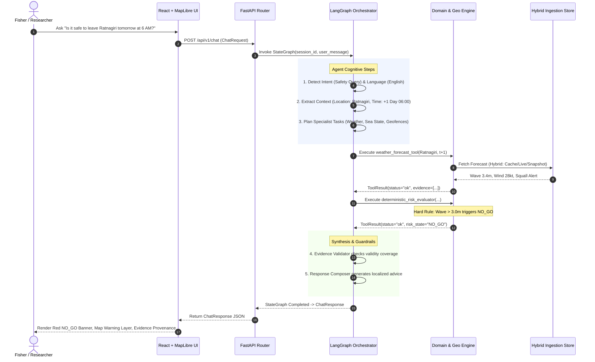

# SAMUDRA Architecture Documentation

> **Smart Autonomous Marine Understanding, Decision & Risk Assistant**  
> **SIH Problem Statement:** PS 26176 — ORCA: Marine EcOsystem Reasoning with Collaborative Agents  
> **Organization:** ISRO / Department of Space | **Theme:** Disaster Management  
> **Status:** 12-Day SIH Functional Prototype Architecture (Modular Monolith)

---

## 1. Architectural Philosophy: The Modular Monolith

SAMUDRA is built as a **Modular Monolith**. In a fast-paced 12-day hackathon environment, distributed architectures (microservices, service meshes, asynchronous event buses, multi-repo setups) introduce severe devops drag, network latency, synchronization bugs, and deployment fragility. 

Instead, SAMUDRA isolates concerns cleanly inside **in-process bounded contexts** sharing a single runtime and typed contracts.

```
┌─────────────────────────────────────────────────────────────────────────────┐
│                             FRONTEND (SPA)                                  │
│             React (TypeScript) + Vite + MapLibre GL JS                      │
│      Chat Interface │ Interactive Map Canvas │ Evidence & Trace Drawer      │
└──────────────────────────────────────┬──────────────────────────────────────┘
                                       │ HTTP / JSON (Shared ChatResponse)
                                       ▼
┌─────────────────────────────────────────────────────────────────────────────┐
│                          FASTAPI APPLICATION                                │
│                                                                             │
│  ┌───────────────────────────────────────────────────────────────────────┐  │
│  │ API & Contracts Layer (/api/v1/chat, /health, Pydantic v2 Schemas)     │  │
│  └───────────────────────────────────┬───────────────────────────────────┘  │
│                                      │                                      │
│                                      ▼                                      │
│  ┌───────────────────────────────────────────────────────────────────────┐  │
│  │ Bounded Agentic Graph (LangGraph)                                     │  │
│  │ - Intent & Locale Detection       - Evidence Validation               │  │
│  │ - Supervisor / Dynamic Planner    - Final Response Composer           │  │
│  │   (Natural language understanding, translation, orchestration)        │  │
│  └───────────────────────────────────┬───────────────────────────────────┘  │
│                                      │ Dispatches deterministic ToolCalls   │
│                                      ▼                                      │
│  ┌───────────────────────────────────────────────────────────────────────┐  │
│  │ Deterministic Domain Engines (No LLM in calculations)                 │  │
│  │ - Marine & PFZ Ranking Engine     - Deterministic Risk Engine         │  │
│  │ - Geospatial & Geofence (Shapely) - Route Exposure Evaluator          │  │
│  └───────────────────────────────────┬───────────────────────────────────┘  │
│                                      │ Queries normalized cache/snapshots   │
│                                      ▼                                      │
│  ┌───────────────────────────────────────────────────────────────────────┐  │
│  │ Data Ingestion & Storage Adapter                                      │  │
│  │ - Mode Controller: LIVE │ HYBRID (Live -> Snapshot) │ SNAPSHOT        │  │
│  │ - Connectors: INCOIS (PFZ/OSF), IMD, MOSDAC, Open-Meteo fallback      │  │
│  │ - PostGIS / SQLite Spatial Persistence + Curated GeoJSON Fixtures     │  │
│  └───────────────────────────────────────────────────────────────────────┘  │
└─────────────────────────────────────────────────────────────────────────────┘
```

---

## 2. High-Level Component Breakdown

### 2.1 Frontend (SPA)
- **Framework**: React 18 + Vite + TypeScript.
- **Geospatial Visualization**: MapLibre GL JS for vector basemaps, rendering:
  - Potential Fishing Zone (PFZ) advisory sectors and line features.
  - Indian Exclusive Economic Zone (EEZ) and restricted maritime geofences.
  - Active weather warnings, cyclone tracks, and elevated wave-height contours.
  - Evaluated route polylines colored by safety score (Green / Amber / Red).
- **UX Surfaces**:
  - *Conversational Bar*: Multi-lingual natural query input with sample chips.
  - *Recommendation Banner*: Instant status card (`GO`, `CAUTION`, `NO_GO`, `UNKNOWN`, `INFORMATIONAL`).
  - *Evidence Drawer*: Complete provenance list showing source, publication time, validity window, and official links.
  - *Agent Trace View*: High-level timeline showing which agents/tools executed (strictly non-leaking internal reasoning).

### 2.2 Backend Platform (FastAPI)
- **Framework**: FastAPI (Python 3.11+), Pydantic v2, HTTPX.
- **Responsibilities**: Request lifecycle, schema validation, rate-limiting, CORS handling, error boundaries, session state, and dispatching tasks to the agent graph.
- **Contract Enforcement**: All inputs and outputs conform strictly to `ChatRequest`, `ChatResponse`, and `ToolResult`.

### 2.3 Agent Runtime (LangGraph)
- **Framework**: LangGraph state graph.
- **Role**: Coordinates the cognitive flow—translating user requests, planning required domain tasks, calling deterministic tools, validating evidence adequacy, and composing natural answers.
- **Boundary Guarantee**: The agent **never** performs math, GIS intersection, risk thresholding, or marine calculations in prompt text. All numerical decisions are delegated to deterministic Python domain tools.

### 2.4 Deterministic Domain & Geospatial Engine
- **Libraries**: Shapely, GeoPandas, PyProj, PostGIS.
- **Responsibilities**:
  - Distance & bearing calculations using ellipsoidal/geodesic models.
  - Point-in-polygon and line-string intersection checks against maritime boundaries (e.g., naval restricted zones, international maritime boundary lines - IMBL, sensitive reefs).
  - Multi-factor risk scoring engine applying strict hard-stops (e.g., IMD Red Alert = unconditional `NO_GO`).
  - Candidate route generation and comparative risk exposure evaluation.

### 2.5 Data Ingestion & Fallback Layer
- **Source Adapters**:
  - **INCOIS**: Potential Fishing Zone (PFZ) advisories and Ocean State Forecast (OSF).
  - **IMD**: Marine weather forecasts, cyclone alerts, gale and squall warnings.
  - **MOSDAC**: Earth Observation context (Oceansat/INSAT sea surface temperature and chlorophyll indicators).
  - **Open-Meteo Marine**: High-resolution fallback for wave height, swell period, wind gust, and ocean currents.
  - **Curated GeoJSON**: Static boundaries for Indian coastal waters, harbor locations, and maritime limits.
- **Operational Modes**:
  - `LIVE`: Queries external APIs in real time.
  - `HYBRID` *(Default for SIH)*: Queries live APIs with timeout; on failure, latency, or rate-limit, seamlessly falls back to pre-seeded, validated snapshots with explicit provenance flags.
  - `SNAPSHOT`: 100% offline, fully reproducible mode for judge demonstrations and deterministic CI testing.

---

## 3. Component Communication & Data Flow



---

## 4. What Is Explicitly Out of Scope (Guards against Feature Creep)

To ensure delivery within the 12-day prototyping window:
1. **No Microservices or Service Buses**: No Kafka, RabbitMQ, Celery, or gRPC. LangGraph runs inside the FastAPI process.
2. **No Production Multi-Tenant RBAC or Payments**: Authentication is mock/simplified session ID based.
3. **No Native Mobile Apps**: The frontend is a responsive web application optimized for mobile and tablet browsers.
4. **No Direct AIS Hardware Transceivers**: Vessel tracking is simulated or accepts manual coordinate inputs; no live satellite AIS feeds.
5. **No Autonomous Navigation Claims**: SAMUDRA is strictly a prototype risk-assessment and advisory platform, not an autopilot or certified SOLAS navigation system.
