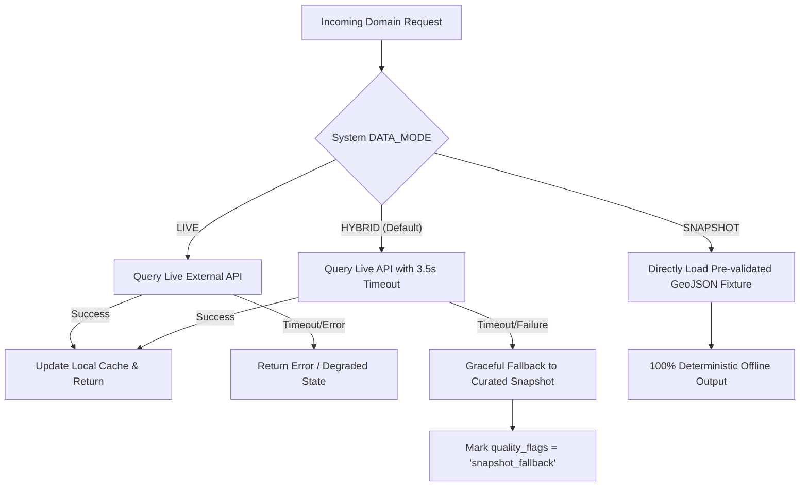

# SAMUDRA Data Sources & Ingestion Strategy

> **SIH Problem Statement:** PS 26176 — ORCA: Marine EcOsystem Reasoning with Collaborative Agents  
> **Source Philosophy:** Evidence-first, verifiable provenance, and resilient multi-mode ingestion.

---

## 1. Planned Data Sources Register

| Source Authority | Dataset / Service | Primary Variables | Access Protocol | Update Frequency | Prototype Fallback |
| :--- | :--- | :--- | :--- | :--- | :--- |
| **INCOIS** (ESSO) | Potential Fishing Zones (PFZ) | Chlorophyll-a front lines, Sea Surface Temperature (SST) gradients, bearing & distance from landing centers | REST API / Web Scraped Bulletin / GeoJSON | Daily (issued ~18:00 IST) | Curated PFZ GeoJSON snapshot (`pfz_west_coast_latest.json`) |
| **INCOIS** (ESSO) | Ocean State Forecast (OSF) | Significant wave height (SWH), swell wave height, wave period, ocean currents | REST API / OpenDAP / TDS | 3-6 hourly updates | Synoptic OSF snapshot (`osf_ratnagiri_latest.json`) |
| **IMD** (MoES) | Marine Weather & Cyclone Bulletins | Squall alerts, wind speed (knots), cyclone position/cone, depression warnings | Coastal bulletin feed / RSS / Portal API | 6-hourly or special event bulletins | IMD cyclone advisory fixture (`imd_cyclone_alert_s3.json`) |
| **MOSDAC** (ISRO) | Earth Observation (Oceansat / INSAT) | Sea Surface Temperature, ocean color, cloud motion vectors | OGC WMS / WFS / REST | Daily / Near Real-Time | Raster / Vector indicator GeoJSON |
| **Open-Meteo** | Marine Weather API | Significant wave height, wind wave, swell direction, surface wind gusts (10m) | Public REST API (`marine-api.open-meteo.com`) | Hourly model forecasts | Offline Open-Meteo response cache |
| **SAMUDRA Curated** | Indian Maritime Geofences | Exclusive Economic Zone (EEZ), Marine Protected Areas (MPAs), defense zones, IMBL | GeoJSON polygon fixtures | Static / Updated per gazette notifications | Local vector fixtures (`geofences_india.geojson`) |

---

## 2. Ingestion Modes: Live, Hybrid, and Snapshot

In high-stakes hackathon demos and field operations, external government portals frequently suffer downtime, IP blocks, or throttling. To prevent demo failures:



### 2.1 Mode Definitions
- **`LIVE`**: Strictly queries external APIs. Useful during development to test real connector integrations.
- **`HYBRID` (Recommended for SIH)**: Attempts live queries. If an endpoint times out (>3.5s) or returns an error, gracefully returns a pre-validated, timestamp-adjusted snapshot while flagging `snapshot_fallback` in the `ChatResponse.warnings`.
- **`SNAPSHOT`**: Bypasses the network entirely. Loads verified offline scenarios from `data/fixtures/`. Guaranteed to work on offline presentation laptops.

> [!WARNING]
> **Integrity Rule**: Never claim live API access has been verified unless it has been tested and confirmed live in production. Always report true provenance in the `evidence` block.

---

## 3. Evidence & Provenance Model

Every factual metric returned to the user must carry full metadata:
```json
{
  "source_name": "INCOIS Potential Fishing Zone Advisory",
  "source_url": "https://incois.gov.in/portal/pfz/pfz.jsp",
  "observed_time": "2026-09-04T12:00:00Z",
  "valid_from": "2026-09-05T00:00:00Z",
  "valid_to": "2026-09-05T23:59:59Z",
  "retrieved_at": "2026-09-04T22:30:00Z",
  "geometry": { "type": "Point", "coordinates": [73.28, 16.99] },
  "metric_name": "significant_wave_height",
  "metric_value": 3.4,
  "metric_unit": "meters",
  "quality_flags": ["official_source", "verified_geometry"]
}
```
If a forecast metric has expired (`now > valid_to`), it cannot be used to certify a `GO` safety state.
