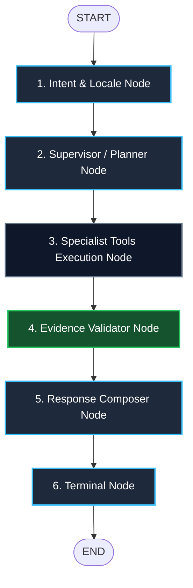

# Milestone M1 Specification: Basic Agent Graph / First End-to-End Vertical Slice

> **Project:** SAMUDRA — Smart Autonomous Marine Understanding, Decision & Risk Assistant  
> **SIH Problem Statement:** PS 26176 — ORCA: Marine EcOsystem Reasoning with Collaborative Agents  
> **Author:** Dev 3 (Agent Orchestration, Conversation & Explainability)  
> **Milestone Status:** **M1 COMPLETE**  

---

## 1. M1 Objective

The objective of Milestone M1 is to operationalize the M0 architecture by building the **first executable end-to-end vertical slice** of the SAMUDRA / ORCA multi-agent pipeline using **LangGraph**.

The workflow demonstrates a complete, bounded transaction:
```
USER INPUT 
  ↓
INTENT / LOCALE 
  ↓
SUPERVISOR / PLANNER 
  ↓
STUB SPECIALIST TOOLS 
  ↓
EVIDENCE VALIDATION 
  ↓
RESPONSE COMPOSITION 
  ↓
FINAL EVIDENCE-BACKED RESPONSE
```

Per the architectural charter:
- **No real external APIs** are invoked.
- **No database connections** are made.
- **No LLM calls** are executed.
- **No Dev 4 domain calculations** are performed.
- All domain data is simulated in-memory and explicitly labeled `M1_DEMO_DATA` / `SIMULATED`.

---

## 2. Graph Architecture & Flow

The pipeline is implemented in [`backend/app/agents/graph.py`](file:///c:/Users/dyara/SAMUDRA/backend/app/agents/graph.py) using `langgraph.graph.StateGraph(ORCAState)`:



### Graph Execution Stages:
1. **`intent_locale`**: Normalizes input query, extracts intent (`PFZ`, `SAFETY`, `CONDITIONS`, `HAZARDS`, `ROUTE`, `ANALYTICAL_EXPLANATION`, `UNSUPPORTED`), detects language (`en`, `mr`, `hi`), and identifies origin harbor.
2. **`supervisor_planner`**: Inspects intent to assemble a bounded `TaskPlan` of specialist tools. Unrelated queries schedule 0 tools.
3. **`specialist_tools`**: Dispatches tools via `AgentToolRegistry`, gathers normalized `ToolResult` objects, updates `observations`, `advisories`, and `evidence`.
4. **`evidence_validator`**: Gating audit ensuring every numerical claim has an unexpired, traceable citation.
5. **`response_composer`**: Synthesizes a localized conversational explanation, strictly preserving deterministic risk status without hallucination.
6. **`terminal`**: Finalizes state, seals trace, and returns output.

---

## 3. State Transitions (`ORCAState`)

| Pipeline Step | Input State Fields | Mutated / Produced State Fields |
| :--- | :--- | :--- |
| **`intent_locale`** | `user_message`, `language`, `thread_id` | `intent`, `language`, `location`, `time_window`, `trace` |
| **`supervisor`** | `intent`, `location` | `task_plan`, `trace` |
| **`specialist_tools`** | `task_plan`, `location`, `user_profile` | `tool_results`, `observations`, `evidence`, `warnings`, `risk_assessment`, `confidence`, `trace` |
| **`evidence_validator`** | `evidence`, `intent`, `observations` | `warnings`, `trace` |
| **`response_composer`** | `intent`, `language`, `risk_assessment`, `evidence` | `response`, `risk_assessment`, `confidence`, `trace` |
| **`terminal`** | `response`, `trace` | `trace` (finalized) |

---

## 4. Intent & Supervisor Behavior

| User Query Intent | Scheduled Stub Tools | Risk Evaluation Required? | Expected Safety Behavior |
| :--- | :--- | :--- | :--- |
| **`PFZ`** | `["pfz_stub"]` | No (in demo slice) | `GO` |
| **`SAFETY`** | `["marine_stub", "weather_stub", "risk_stub"]` | **Yes** (`risk_stub`) | `CAUTION` (or `NO_GO` if wave > 2.5m) |
| **`CONDITIONS`** | `["marine_stub"]` | No | `INFORMATIONAL` |
| **`HAZARDS`** | `["weather_stub"]` | No | `INFORMATIONAL` |
| **`ROUTE`** | `["route_stub"]` | No | `CAUTION` |
| **`ANALYTICAL_EXPLANATION`** | `["explanation_stub"]` | No | `CAUTION` |
| **`UNSUPPORTED`** | `[]` (Zero tools) | No | `INFORMATIONAL` (Graceful guidance) |

---

## 5. In-Memory Stub Tools

Implemented in [`backend/app/agents/stub_tools.py`](file:///c:/Users/dyara/SAMUDRA/backend/app/agents/stub_tools.py) and registered with `tool_registry`:

- **`pfz_stub`**: Simulated PFZ coordinates 12.4 nm bearing 285° from harbor (depth: 45m, chlorophyll: 1.25 mg/m³).
- **`marine_stub`**: Simulated wave height (1.8m), swell height (1.2m), swell period (8.5s).
- **`weather_stub`**: Simulated coastal winds (16 kts, gusts 22 kts), cyclone alert (`False`).
- **`risk_stub`**: Simulated Dev 4 Risk Engine. Evaluates wave height against vessel ceiling; returns immutable `Recommendation(status=CAUTION)`.
- **`route_stub`**: Simulated passage comparison between Inshore Channel (1.4m waves) and Deepwater Channel (2.2m waves).
- **`explanation_stub`**: Simulated marine reef buffer zone justification (`RESTRICTED-REEF-ZONE-4`).

---

## 6. Evidence Provenance Flow

The golden rule of SAMUDRA is verified in M1:
> **Every numerical claim in the final answer is backed by an `EvidenceItem`.**

Every stub tool produces an `EvidenceItem` with:
- `source_name` (e.g. `INCOIS Ocean State Forecast (Simulated M1 Demo)`)
- `metric_name` (e.g. `significant_wave_height`)
- `metric_value` (e.g. `1.8`)
- `quality_flags` (`["M1_DEMO_DATA", "SIMULATED"]`)

`EvidenceValidator.audit_evidence()` verifies that required metrics exist before the response composer writes the final answer.

---

## 7. Response Flow & Safety Invariance

`ResponseComposer` synthesizes the response template:
- If `risk_assessment` exists in state, the composer **strictly preserves** the `RecommendationStatus` (`GO`, `CAUTION`, `NO_GO`, `UNKNOWN`).
- `ResponseComposer.validate_safety_invariance()` compares the final response against original risk assessment; any softening or tampering raises a fatal exception.
- Explicit notice is attached to all responses:
  `"Notice: This is an M1 demonstration response generated from simulated marine, weather, and risk inputs. Live safety decisions are not available in M1."`

---

## 8. Sanitized Trace Flow

Every execution produces an audit-friendly `List[AgentTraceItem]` without chain-of-thought tokens:
```json
[
  {"step": 1, "node": "Intent / Locale", "action": "Detected intent 'PFZ' and locale 'en' (Harbor: Ratnagiri)", "status": "completed"},
  {"step": 2, "node": "Supervisor / Planner", "action": "Constructed TaskPlan with 1 tool(s): ['pfz_stub']", "status": "completed"},
  {"step": 3, "node": "Specialist Tool: pfz_stub", "action": "Executed 'pfz_stub' (status: ok, evidence items: 1)", "status": "completed"},
  {"step": 4, "node": "Evidence Validator", "action": "Audited 1 citation(s) against critical metrics (Quality: robust)", "status": "completed"},
  {"step": 5, "node": "Response Composer", "action": "Synthesized localized response with evidence backing (Status: GO)", "status": "completed"},
  {"step": 6, "node": "Terminal", "action": "Pipeline execution successfully validated and finalized", "status": "completed"}
]
```

---

## 9. Automated Test Results

Executed with `C:\Python313\python.exe -m pytest tests/contract/ tests/integration/ tests/agent_eval/ -v`:
```
tests/contract/test_contracts.py::test_valid_chat_response_serialization PASSED
tests/contract/test_contracts.py::test_invalid_recommendation_status_raises_error PASSED
tests/contract/test_contracts.py::test_tool_result_serialization PASSED
tests/integration/test_health.py::test_health_check_endpoint PASSED
tests/integration/test_health.py::test_scenarios_listing_endpoint PASSED
tests/integration/test_health.py::test_chat_placeholder_returns_501 PASSED
tests/agent_eval/test_agent_contracts.py::test_orca_state_typing_and_alias PASSED
tests/agent_eval/test_agent_contracts.py::test_intent_category_and_normalization PASSED
tests/agent_eval/test_agent_contracts.py::test_supervisor_standard_plans PASSED
tests/agent_eval/test_agent_contracts.py::test_tool_registry_boundary_enforcement PASSED
tests/agent_eval/test_agent_contracts.py::test_memory_context_carry_forward PASSED
tests/agent_eval/test_agent_contracts.py::test_trace_sanitization_no_cot_leakage PASSED
tests/agent_eval/test_agent_contracts.py::test_response_composer_safety_invariance PASSED
tests/agent_eval/test_agent_contracts.py::test_evidence_validator_audit PASSED
tests/agent_eval/test_agent_contracts.py::test_eval_benchmark_fixtures_validity PASSED
tests/agent_eval/test_m1_graph.py::test_m1_pfz_vertical_slice PASSED
tests/agent_eval/test_m1_graph.py::test_m1_safety_vertical_slice PASSED
tests/agent_eval/test_m1_graph.py::test_m1_conditions_vertical_slice PASSED
tests/agent_eval/test_m1_graph.py::test_m1_unsupported_query PASSED
tests/agent_eval/test_m1_graph.py::test_m1_tool_registry_execution PASSED
tests/agent_eval/test_m1_graph.py::test_m1_evidence_validation PASSED
tests/agent_eval/test_m1_graph.py::test_m1_safety_invariance PASSED
tests/agent_eval/test_m1_graph.py::test_m1_trace_generation PASSED
tests/agent_eval/test_m1_graph.py::test_m1_graph_terminates PASSED

======================= 24 passed, 2 warnings in 0.51s =======================
```

---

## 10. Known Limitations in M1

1. **In-Memory Simulated Data Only**: No live INCOIS/IMD connectors or GIS databases are connected.
2. **Deterministic Heuristics**: Intent classification is pattern-matched; no real LLM embeddings are invoked.
3. **Sequential Execution**: Specialist tools currently execute sequentially in in-memory simulation.
4. **Clarification Loop**: Currently defaults to standard harbor fallback ("Ratnagiri") rather than pausing for multi-turn user clarification.

---

## 11. Next Steps for Milestone M2

1. Wire real Dev 4 tools (`get_pfz_advisories`, `get_marine_weather`, `evaluate_safety_thresholds`, `evaluate_route_exposure`) into `AgentToolRegistry`.
2. Connect Dev 2 cached connector data feeds into the specialist tool inputs.
3. Implement concurrent tool dispatch for independent steps (`marine_stub` + `weather_stub`).
4. Activate conversational clarification loops when essential parameters are missing.
