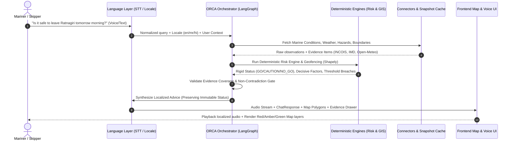

# ORCA Master Context: Canonical System Specification

> **SIH 2026 Problem Statement:** PS 26176 — ORCA: Marine EcOsystem Reasoning with Collaborative Agents  
> **Theme:** Disaster Management & Maritime Intelligence  
> **Classification:** Authoritative Project Context & Verified System Baseline  
> **Repository Baseline:** SAMUDRA (Smart Autonomous Marine Understanding, Decision & Risk Assistant)

---

## 1. Project Identity

* **Project Name:** ORCA — Marine EcOsystem Reasoning with Collaborative Agents
* **Active Codebase Moniker:** SAMUDRA (`Smart Autonomous Marine Understanding, Decision & Risk Assistant`)
* **Problem Statement:** PS 26176 (SIH 2026) — Sponsored by Indian Space Research Organisation (ISRO) / Department of Space
* **Core Value Proposition:** A mission-intelligence reasoning layer positioned above India's existing fragmented marine information ecosystem (ISRO MOSDAC, INCOIS, IMD, Coast Guard, Fisheries Departments).

---

## 2. Problem Being Solved

India possesses extensive, world-class marine and Earth Observation capabilities:
* **INCOIS:** Potential Fishing Zone (PFZ) advisories, Ocean State Forecasts (OSF), High Wave Alerts, and Tsunami early warnings.
* **ISRO MOSDAC:** Oceansat and INSAT satellite feeds, Sea Surface Temperature (SST), and Chlorophyll-a gradient maps.
* **IMD:** Cyclone bulletins, coastal squall advisories, port warning flags, and depression tracks.
* **Maritime Authorities:** Naval firing exercises, Marine Protected Areas (MPAs), and International Maritime Boundary Lines (IMBL).

**The Core Bottleneck:**
Traditional artisanal fishers, boat skippers, and local port authorities cannot synthesize these disparate, high-latency, format-divergent bulletins in real time. A mariner preparing to leave port must manually cross-reference wave heights, wind vectors, squall advisories, restricted boundaries, and fish concentration forecasts while navigating language barriers and low-connectivity environments.

---

## 3. Product Positioning & What ORCA Is vs. Is Not

### What ORCA IS:
* **Mission Intelligence Layer:** Answers operational questions directly (*"Can I go fishing tomorrow morning from Kochi?"*).
* **Deterministic Risk Gate:** Combines natural language understanding with 100% deterministic, Python-computed geospatial and safety calculations.
* **Multi-Source Reasoning Engine:** Unifies oceanography, meteorology, fisheries science, and maritime regulations into an actionable verdict: `GO`, `CAUTION`, `NO_GO`, or `UNKNOWN`.
* **Multilingual & Voice-Enabled:** Supports voice calls and text in Indian languages (Marathi, Hindi, English, Tamil).
* **Evidence & Provenance Bound:** Every recommendation must explicitly reference authoritative timestamps, URLs, and official agencies.

### What ORCA IS NOT:
* ❌ Not a generic conversational LLM chatbot with hallucinated weather data.
* ❌ Not an autonomous vessel navigation system or autopilot.
* ❌ Not a certified SOLAS (Safety of Life at Sea) life-safety system.
* ❌ Not a pure multi-agent theoretical sandbox; it enforces rigid runtime safety bounds.
* ❌ Not an LLM that calculates wave heights or distances internally.

---

## 4. User Taxonomy

### Primary User (70% Prototype Focus)
* **Coastal Fisherman / Vessel Skipper / Boat Operator:**
  * Needs immediate, high-stakes voyage clarity: *"Can I leave at 6 AM?", "Where are the fish?", "Which route is safe?"*
  * Requires vernacular speech/audio interaction (hands-free on rough waters) and high-contrast, simple visual cues.
  * Operates three vessel profiles:
    1. `traditional_non_motorized` (strictest thresholds: wave ceiling 1.5m, wind 18 kn).
    2. `motorized_boat` (wave ceiling 2.5m, wind 25 kn).
    3. `mechanized_trawler` (wave ceiling 3.5m, wind 35 kn).

### Secondary User (30% Focus)
* **Fisheries Department / Disaster Management Authority / Harbor Master:**
  * Audits zone alerts, monitors active squall/cyclone polygons along coastal sectors, cross-references fleet advisory compliance, and tracks data freshness.

---

## 5. Flagship Workflow: ASK → SIMULATE → DECIDE → ADAPT



---

## 6. Current Verified Architecture vs. Target Architecture

### VERIFIED / CURRENT in Repository
* **FastAPI Backend (`backend/app/`):**
  * Fully asynchronous API factory with CORS, request-size limits, and error handling.
  * Canonical REST endpoints: `/api/v1/chat`, `/api/v1/voice/chat`, `/api/v1/voice/transcribe`, `/api/v1/scenarios`, `/api/v1/health`, `/api/v1/layers/base`.
* **Deterministic Domain Engines (`backend/app/domain/`):**
  * `DeterministicRiskEngine`: Authoritative Python threshold comparator across craft classes; absolute hard-stops on IMD Red Alerts and boundary breaches.
  * `MapLayerEngine`: Generates MapLibre GeoJSON layers for risk buffers, PFZ lines, and route exposure polylines.
* **LangGraph Cognitive Graph (`backend/app/agents/graph.py`):**
  * Multi-node state graph: `intent_locale` → `supervisor_planner` → `specialist_tools` → `evidence_validator` → `response_composer` → `terminal`.
  * Multi-turn conversational memory with `InMemoryConversationStore` and `SQLAlchemyConversationStore`.
* **Voice Subsystem (`backend/app/services/`):**
  * Sarvam AI `saaras:v4` STT transcription with ISO-639-1 language normalization.
  * Sarvam AI `bulbul:v3` TTS synthesis with markdown stripping.
  * Faster-Whisper local backup capabilities.
* **Modern Web Frontend (`frontend/src/`):**
  * React 18, Vite, TypeScript, MapLibre GL JS vector maps (CartoDB Positron/Dark Matter).
  * Full duplex phone-style voice modal (`CallModal.tsx`) with client-side VAD (Voice Activity Detection), audio level meters, and instant speech interruption.
  * Slide-out Evidence Drawer (`EvidenceDrawer.tsx`) and Agent Trace Timeline (`AgentTimeline.tsx`).
  * Trilingual localization (English, Marathi, Hindi) across all UI elements and responses.

### PLANNED / FUTURE Target Architecture
* **Dynamic "Mission Twin":** Interactive counterfactual parameter simulation (*"What if I delay departure to 11 AM?", "What if I use a mechanized trawler instead?"*).
* **Automated VHF Marine Radio Broadcast Generator:** Direct audio streaming to coastal base stations.
* **Live In-Situ Sensor Integrations:** Direct NavIC NMEA-0183 serial feeds and real-time AIS vessel telemetry.
* **ToolGrad Workflow Optimization:** Systematic reinforcement and fine-tuning of multi-tool invocation trajectories.

---

## 7. Approved Marine Data Ecosystem & Integration Status

| Priority | Data Source | Operational Purpose | Implementation Files | Data Mode Behavior | Source Status |
| :--- | :--- | :--- | :--- | :--- | :--- |
| **P0** | **INCOIS OSF** | Wave height, swell, currents, sea surface temperature | `connectors/incois.py` | Live URL configured; falls back to Open-Meteo in HYBRID mode; fixtures in SNAPSHOT | `LIMITED / CACHED_REAL` |
| **P0** | **INCOIS PFZ** | Potential Fishing Zones, bearing, distance, SST gradients | `connectors/incois.py`, `domain/map_layers.py` | Ingests official INCOIS advisories; falls back to snapshot fixtures | `CACHED_REAL` |
| **P0** | **INCOIS SVAS** | Small Vessel Advisory Services, capsizing risk, craft ceilings | `contracts dev2/`, `domain/risk_engine.py` | Crafts limits evaluated in Python; live portal adapter scheduled | `CACHED_REAL / MOCK` |
| **P0** | **IMD Marine Weather** | Wind speed, gust, visibility, coastal sea bulletins | `connectors/imd_weather.py` | Bulletin parser with automated alert extraction; snapshot fallback | `LIMITED / CACHED_REAL` |
| **P0** | **IMD Hazards & Cyclone**| Squall alerts, depression tracks, port warning signals | `connectors/imd_hazard.py` | Bulletin parser; triggers hard-stops on active cyclone/squall alerts | `LIMITED / CACHED_REAL` |
| **P0** | **Open-Meteo Marine** | High-resolution wave height, swell period, wind fallback | `connectors/open_meteo.py` | Live HTTP client with 1-hour cache and retry logic (unauthoritative fallback) | `LIVE` |
| **P0** | **Pilot-Region GIS** | Indian EEZ, MPAs (Malvan), Naval Firing Ranges (Goa), IMBL | `data/fixtures/geofences_india.geojson`, `data/reference/marine_restrictions.geojson` | Geospatial GeoJSON fixtures queried via Shapely | `CACHED_REAL` |
| **P0** | **Landing & Craft Ref**| Coastal landing centres and calibrated vessel profiles | `data/reference/landing_centres.json`, `data/reference/vessel_profiles.json` | Static authoritative catalogs for harbor coordinates and vessel dimensions | `CACHED_REAL` |
| **P1** | **NDMA SACHET / CAP** | Independent disaster alerts, coastal evacuation notices | Scheduled in `connectors/sachet.py` | CAP XML/JSON feed corroboration; alerts layer in Phase 6 | `PLANNED` |
| **P1** | **ISRO MOSDAC** | Satellite Earth Observation (Chlorophyll, SST rasters) | Referenced in `config.py`, scheduled in `connectors/mosdac.py` | OGC WMS/WFS/REST raster layers for UI overlays in Phase 11 | `PLANNED` |
| **P2** | **INCOIS SARAT** | Search and Rescue Aid-Tool drift trajectories | Scheduled in `connectors/sarat.py` | Dedicated Search-and-Rescue mission mode in Phase 11 | `PLANNED` |
| **P2** | **VCSS / Nabhmitra** | Two-way satellite vessel communication context | Optional Phase 11 integration | Authorized vessel tracking; hardware dongle serial ingestion | `PLANNED` |

---

## 8. Inviolable Safety & Decision Principles

1. **Deterministic Authority:** The LLM NEVER calculates numerical thresholds, wave risks, or geodesic distances. All safety decisions originate strictly in Python code (`DeterministicRiskEngine`).
2. **The 5 Hard-Stops:**
   * Active IMD Cyclone Warning or Red Alert within 50 nm triggers unconditional `NO_GO`.
   * Prohibited maritime boundary breach triggers unconditional `NO_GO`.
   * Stale telemetry (>24h) or missing critical data can NEVER produce a `GO` status (must return `UNKNOWN` or `CAUTION`).
   * LLM Non-Contradiction Gate: The response composer cannot soften or overturn a deterministic `NO_GO`.
   * Hallucination Gate: Uncited numerical marine claims are stripped from model output.
3. **Derived Confidence:** Confidence (`HIGH`, `MEDIUM`, `LOW`) is derived deterministically from source freshness and official authority, not generated by an LLM guessing percentages.

---

## 9. Verified Repository Map

```text
SAMUDRA/ (ORCA)
├── backend/
│   ├── alembic/                         # Database schema migrations
│   ├── app/
│   │   ├── agents/                      # LangGraph multi-node cognitive graph
│   │   │   ├── graph.py                 # Core executable LangGraph pipeline
│   │   │   ├── intent.py                # Deterministic & LLM intent classifier
│   │   │   ├── localization.py          # Marathi/Hindi/Tamil entity normalization
│   │   │   ├── memory.py                # Session & conversation memory stores
│   │   │   ├── response.py              # Evidence-grounded response composer
│   │   │   └── security.py              # Prompt injection detection & sanitization
│   │   ├── api/                         # FastAPI routing & middleware
│   │   │   └── v1/routes.py             # REST endpoints (/chat, /voice/chat, /scenarios)
│   │   ├── connectors/                  # Live & hybrid adapters (INCOIS, IMD, Open-Meteo)
│   │   ├── contracts/                   # Canonical Pydantic schemas (ChatResponse, etc.)
│   │   ├── core/                        # Settings, logging, and environment configuration
│   │   ├── db/                          # SQLAlchemy models & PostGIS session management
│   │   ├── domain/                      # Deterministic Python math & risk rules
│   │   │   ├── risk_engine.py           # Vessel-class threshold & safety rules engine
│   │   │   └── map_layers.py            # GeoJSON layer generator for MapLibre
│   │   ├── prompts/                     # System prompts for intent, supervisor, composer
│   │   ├── scenarios/                   # S1–S8 benchmark execution runner & registry
│   │   ├── services/                    # STT (Sarvam) & TTS (Sarvam) audio pipeline
│   │   └── main.py                      # FastAPI application factory & lifespan
│   └── requirements.txt                 # Backend Python dependencies
├── frontend/
│   ├── src/
│   │   ├── api/                         # Frontend API client & typed error envelopes
│   │   ├── components/
│   │   │   ├── call/CallModal.tsx       # Duplex phone-style voice call interface
│   │   │   ├── chat/ChatPanel.tsx       # Multilingual chat & sample prompt chips
│   │   │   ├── evidence/EvidenceDrawer.tsx # Slide-out evidence & trace drawer
│   │   │   ├── map/MapView.tsx          # MapLibre GL JS vector map canvas
│   │   │   └── recommendation/RecommendationBanner.tsx # Status banner (GO/CAUTION/NO_GO)
│   │   ├── hooks/                       # Custom hooks (useChat, useCallSession, useVoice)
│   │   ├── i18n/translations.ts         # English, Hindi, and Marathi translations
│   │   ├── types/contracts.ts           # TypeScript interfaces mirroring Pydantic schemas
│   │   └── App.tsx                      # Main responsive application shell
│   ├── package.json                     # Frontend dependencies
│   └── vite.config.ts                   # Vite bundler configuration
├── data/
│   ├── fixtures/                        # S1–S8 scenario test data & geofences
│   │   ├── scenarios/                   # Canonical evaluation scenario files
│   │   └── geofences/                   # Static boundary geometries
│   ├── source_snapshots/                # Cached snapshots for offline zero-latency demo
│   │   ├── incois/                      # Real pre-captured OSF and PFZ bulletins
│   │   ├── imd/                         # Real pre-captured weather and hazard alerts
│   │   └── open_meteo/                  # Real pre-captured marine weather responses
│   └── reference/                       # Canonical baseline static catalogs
│       ├── landing_centres.json         # Authoritative landing centres & coordinates
│       ├── vessel_profiles.json         # Calibrated vessel parameters & limits
│       └── marine_restrictions.geojson  # Naval, MPA, and international buffer zones
├── docs/                                # Canonical system documentation
└── tests/                               # 526 automated test cases across backend & agents
```

---

## 10. Operational Verification Baseline (Audit Findings)

* **Backend Test Suite:** **475 passed, 51 skipped** (skipped tests require live PostgreSQL/PostGIS container; all in-memory, contract, domain, agent evaluation, and voice tests pass 100%).
* **Frontend Test Suite:** **39 passed across 6 test files** (Vitest / React).
* **Frontend Production Build:** **Compiled cleanly** with Vite in 41.03s; zero TypeScript errors (`tsc --noEmit` passed).
* **Voice Pipeline:** Fully verified with `sarvamai` SDK for bidirectional STT and TTS across Hindi, Marathi, and English.
